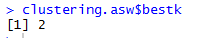

# Campaña de marketing segmentada para clientes bancarios
## **Determinar objetivos del negocio**
Ofrecer paquetes de servicios para cada agrupación de clientes encontrada que se adapten a las necesidades, deseos y poder adquisitivo los clientes bancarios, para poder aumentar las ganancias del banco.  
- ### **Contexto:** 
  Se analizan 243.336 transacciones realizadas por 47.871 clientes en el último mes de diferentes bancos en créditos de consumo, para determinar los grupos de investigación.
- ### **Objetivos de negocio**
  El objetivo del banco es desarrollar promociones que permitan aumentar el portafolio de servicios adquiridos por los clientes, según los grupos a los que pertenecen los clientes por sus ocasiones de consumo.
- ### **Criterios del éxito del caso**
  La obtención de información relevante desconocida en las transacciones bancarias que permita crear campañas de marketing efectivas para cada grupo de clientes.
## **Determinar objetivos de la minería de datos**
El objetivo principal de la minería de datos es encontrar grupos de clientes bancarios que compartan características de consumo semejantes para poder ofrecer paquetes especializados de servicios por grupos.
### **Criterios de éxito**
- Encontrar al menos una estrategia de venta de nuevos portafolios para cada clúster encontrado en el desarrollo del análisis.
- Identificar horarios de consumo de los grupos para saber en qué momento enviar las ofertas promocionales.
- Validar características distintivas de cada uno de los grupos establecidos que permitan, comportamiento de consumo de los clientes. 	
# **Compresión de datos**
## **Exploración de datos**
Cuando se evalúa la temporalidad de las transacciones tanto en día de la semana como en jornadas (Mañana, tarde, noche). Se encuentra que las transacciones son estables entre semana con un alza los días sábado y con mayor actividad en horas de la tarde.

Según los datos de transacciones recuperados se encuentra que el mayor porcentaje de uso de tarjetas corresponde a las tarjetas mastercard de uso nacional que se llevan más del 50% de los resultados seguido por transacciones realizadas con tarjetas Visa. También se evidencia que se presenta un muy bajo consumo de tarjetas internacionales de cualquier denominación. 

El 80% de las transacciones de consumo más frecuente corresponde a 14 sitios. Donde se encuentra que las comprar en supermercados / tiendas representan el 22% del total de las transacciones. 

`	`
## **Verificación de la calidad de los datos**
Al realizar la exploración de las distribuciones de cada una de las veinte tres variables (tendencia central, forma y dispersión), se evidencia que, para la mayoría de las variables identificadas en la matriz de datos, presentan coeficiente de curtosis y asimetrías altamente positivas que indican la presencia de colas muy alargadas y de datos atípicos.

Al realizar el grafico de caja de bigotes para los porcentajes de consumo por día de la semana encontramos alta presencia de ceros e los datos y cajas muy simétricas para todos los días exceptuando el sábado.

Cuando se miran los histogramas de las variables número de transacciones y promedio de transacciones encontramos distribuciones claramente exponenciales en as cuales tenemos mayor concentración de datos en el lado izquierdo del gráfico.

  

Cuando análisamos los procentajes de consumo para cada tipo de tarjena nivel nacional e internacional, observamos que son variables que se ven casi binarias y valdria la pena explorar una posible transformación de estas.

Similar a lo anterior ocurre en los porcentajes de consumo por franja horaria, aunque estos si muestran más información en el medio del histograma.

# **Preparación de los datos**
## **Limpieza de los datos**
Para poder realizar un análisis de clúster adecuado se hace necesario evaluar las correlaciones que puedan existir entre las diferentes variables con el fin de reducir el número de las mismas y evitar así darle mayor peso a alguna de las variables.

En esta matriz se evidencia que las variables promedio por transacción, transacción mínima, transacción máxima, desviación por transacción están altamente correlacionadas por lo que solo se va a trabajar con la variable de promedio por transacción.

Debido a que la variable promedio por transacción presenta registros menores a $1.000 COP se decide eliminar los mismos, debido a que estas no representan compras reales en la mayoría de los casos sino ajustes a saldos o intereses, por lo que no resultan de utilidad para la segmentación.
## **Estructuración de los datos**
Como parte de la estructuración de los datos se decide trabajar con tres variables que resuman las 8 variables sobre porcentajes de consumo nacional e internacional por tipo de tarjeta. De tal manera que estas quedaran distribuidas de la siguiente forma:

- VisaN = % consumo visa nacional
- MasterN = % consumo master nacional
- Otras = % consumo visa internacional + % consumo master internacional +% consumo otra nacional + % consumo otra internacional

Tomando esto en cuenta se tiene que en total se analizaran 15 Variables que corresponden a: promedio de transacciones, número de transacciones, VisaN, MasterN, Otras, %lunes, %martes, %miércoles, %jueves, %viernes, %sábado, %domingo, %mañana, %tarde y %noche.
## **Formateo de los datos**
Los porcentajes de consumo según tipo de tarjeta, porcentaje de consumo por jornada y porcentaje de consumo por día son variables multicolineales, por lo que se decide transformar estas variables, calculando un aproximado del total de consumo para cada variable, de la siguiente manera:

Consumo total = X’ \* %Consumo \* Número de transacciones
Donde:
X’: Número aleatorio con distribución normal con parámetros el promedio de la transacción y desviación por transacción para cada cliente.

Por motivo de esta transformación se elimina la variable número de transacciones dado que está queda correlacionada con la mayoría de las variables de consumo.

Debido a la presencia de colas muy alargadas y presencia de asimetrías y curtosis altamente positivas que puedan influenciar la adecuada descripción de los clientes, se hace evidente la necesidad de una transformación por lo que se aplica logaritmo en base 10 y se normalizan todas las variables para subsanar esta situación. Con lo que obtenemos los siguientes resultados: 

# **Modelado**
## **Generación de un plan de prueba**
Como plan de prueba, se van a realizar pruebas de caja negra. Se realizarán pruebas funcionales de la ejecución de la técnica de modelado, observando los datos de entrada y los resultados obtenidos, comprobando que estos resultados son consecuentes con los datos estadísticos obtenidos en la exploración de los datos (Nichizaki, 2017). De manera que se puedan hacer deducciones de negocio sobre estos. Además, se probará la robustez del modelo evaluando cuanto cambia cuando se quitan u agregan datos.
## **Construcción del modelo**
Para la construcción del modelo se escoge el método de k-medias usando distancias euclidianas el cual permite agrupar conjuntos de datos en distintos clústeres que en un principio se desconocen. Este modelo intenta revelar los patrones en el conjunto de datos, agrupando las instancias de manera que las de un mismo clúster tienden a ser similares entre ellas.
- ### **Configuración de parámetros**
  Para la elección del número de clúster a generar (k) se van a realizar 3 análisis: grafico de codo, criterio de average sillouethe width y estadística Gap. Los cuales van a ser realizados tomando una muestra del total de clientes. Está va a tener un tamaño de 482 clientes elegidos aleatoriamente lo cual se calculó con base en la siguiente ecuación con un nivel de confianza del 95% y margen de error del 5%. Y se corre 10 veces con diferentes muestras para evitar sesgos.

  ![ref2]![ref3]

  - Gráfico de codo

- Criterio ASW

  El Criterio ASW sugiere como número de clústeres el valor de 2 para las 10 iteraciones

  

- Estadística GAP

  La estadística gap sugiere en el 70% de los casos como número de clústeres el valor de 9.

Tomando en cuenta los resultados anteriores se van a realizar 9 clústeres.
- ### **Ejecución del modelo**
Resultados de centros de grupos:

Tamaño de grupos:

Cuando se evalúan los datos iniciales se identifica que actualmente la base está dividida solo en cinco grupos, por lo que se decide seguir con este criterio así que se realiza un clúster jerárquico donde los grupos de agruparán como se ve en la imagen y se dividirán en los cinco grupos que indica la línea de corte

 
## **Evaluación del modelo**
Para evaluar la robustez del modelo se realiza un remuestreo de los clústeres generados (bootstrapping), donde encontramos los siguientes resultados:

Se evidencia que todos los clústeres superan el criterio de robustez. O están muy cerca de supéralo como el 1 y el 2.
# **Evaluación**
## ` `**Evaluación de los resultados**
Al explorar nuevamente lo datos de transacciones, incluyendo la segmentación obtenida por la aplicación de técnicas de clustering. Encontramos con éxito patrones de compra específicos por día de la semana y bloque horario lo cual eran dos de los criterios de éxito de la minería. De este modo se ve reflejado en las gráficas fuertes atributos diferenciadores de los grupos donde como por ejemplo el grupo 4 consume más que los viernes y el grupo 2 tiene casi ningún consumo por las tardes. 

La segmentación también cumplió con el objetivo de encontrar características distintivas de cada uno de los grupos establecidos que permitan, comportamiento de consumo de los clientes, donde sabemos para cada grupo cuales son los tipos de tarjeta que mas usan y cuales son los sitios de compra más frecuente de la mayoría de los clientes por cada clúster y cuánto dinero está consumiendo cada grupo.

 

# **Implementación**
## **Informe final**
- ### **Perfilamiento de clientes:**

- ### **Análisis de estrategia de mercado por grupo**
Con base en el perfilamiento realizado a los clientes en base a la segmentación se propone la siguiente estrategia para cada grupo.

- Compradora de ofertas: realizar una alianza con almacenes de calzado y supermercados por departamento (Fallabela, Exito) por departamentos para enviar mensajes en horas de la tarde sobre ofertas pagando con tarjetas del banco.
- Comprador focal: Ofrecer nuevos servios de pago rápido, 

[ref1]: 004.png
[ref2]: 032.png
[ref3]: 033.png
